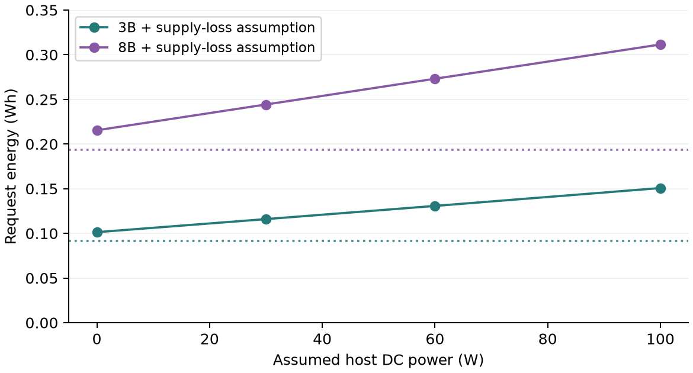

# AutoYou Research

Research code, measurements, papers, and figures for studying inference and
adaptation on consumer hardware.

| Material | Status |
| --- | --- |
| [Track A: consumer inference measurements](paper/main.pdf) | Current working paper, revised 20 September 2026; not peer reviewed |
| [Track B: on-device adaptation](paper/adaptation.pdf) | Earlier companion study; not validated by the Track A revision |
| [Earlier Track A](paper/archive/track-a-legacy.pdf) | Historical draft with superseded claims; see [revision notes](paper/archive/README.md) |

## Read the current study

**Right-Sized AI at the Edge: Reproducible Measurements and Conditional
Sustainability Analysis** examines stored measurements from Radeon 8060S and
RTX 5070 systems. It separates board telemetry, modeled host overhead, and
conditional environmental accounting.

The offline audit replays 68 stored generation repetitions, including 38 requests
with bracketed board-power traces. The RTX 5070 primary and repeat sessions have
rounded board-energy medians of 0.091 Wh and 0.19 Wh for the recorded 3B and 8B
builds, at 499 input and 300 output tokens. Modeled host power is a separate term.



The records do not establish a quality-matched cloud comparison, observed routing
coverage, independent laboratory replication, or fleet-wide savings. The revised
paper withdraws the earlier 54-64% carbon-saving and approximately 150x cost claims.
Read the [review report](review/REVIEW_REPORT.md) and
[reference audit](review/REFERENCE_AUDIT.md) for the reasons and evidence limits.

## Reproduce the revised paper

Use Python 3.10 or later. From this repository:

```bash
python -m venv .venv
# Activate .venv using your shell's activation command.
python -m pip install -r requirements.txt
python review/audit.py
python -m unittest discover -s review -v
python -m unittest measure.test_bench -v
```

These commands replay stored data without calling a model service or reading
private data. The audit regenerates the tables, review figures, and
`review/audit_results.json`. A replay checks arithmetic, not the authenticity
or calibration of the original physical measurement.

To build the PDF, install a TeX distribution with `pdflatex`, BibTeX, IEEEtran,
and the packages declared in the manuscript, then run:

```bash
python review/build_paper.py
```

Running `measure/bench.py` is a separate live experiment that can load and unload
models. See [measurement instructions](measure/README.md) and use new output files
so the archived records stay intact.

## Figures and earlier work

The [figure gallery](figures/README.md) retains the earlier research visuals and
their generation code. Historical scenario figures illustrate assumptions; they
are not measurements or evidence for claims withdrawn in the current paper.

`models/` contains the earlier footprint, routing, and adaptation analyses.
Its `run_all.py` regenerates legacy figures and `paper/empirical.tex`.
Its number-matching `verify_paper.py` checks the archived Track A source and
companion manuscript; it is not the validation gate for the revised paper.

The companion adaptation study remains available with its original limitations.
Private adapter-evaluation inputs are excluded. Results requiring those inputs
must remain unavailable on a public checkout.

## Repository map

| Path | Contents |
| --- | --- |
| `paper/` | Current Track A, companion Track B, bibliographies, and archived Track A |
| `review/` | Offline arithmetic audit, tests, revision report, and input hashes |
| `measure/` | Benchmark harness and original records |
| `figures/` | Current review figures and retained historical research figures |
| `models/` | Earlier scenario and adaptation models |
| `agent/` | Reference routing implementation, not an evaluated deployment |
| `literature/` | Annotated literature notes |

## Contribute and cite

See [CONTRIBUTING.md](CONTRIBUTING.md) for experiments, corrections, and pull requests.
Use [CITATION.cff](CITATION.cff) when citing the revised working paper. Identify the
Git commit and measurement filenames when reusing records.

Author: AutoYou Research.
Contact: research@autoyou.me.

The [MIT license](LICENSE) is unchanged and covers the repository's code,
manuscripts, figures, and measurement records. Model weights are not included.
